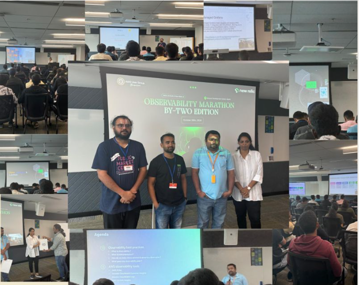
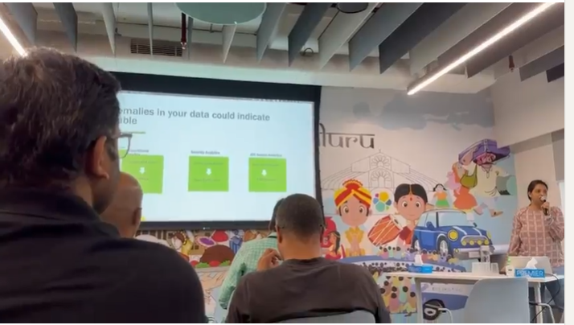
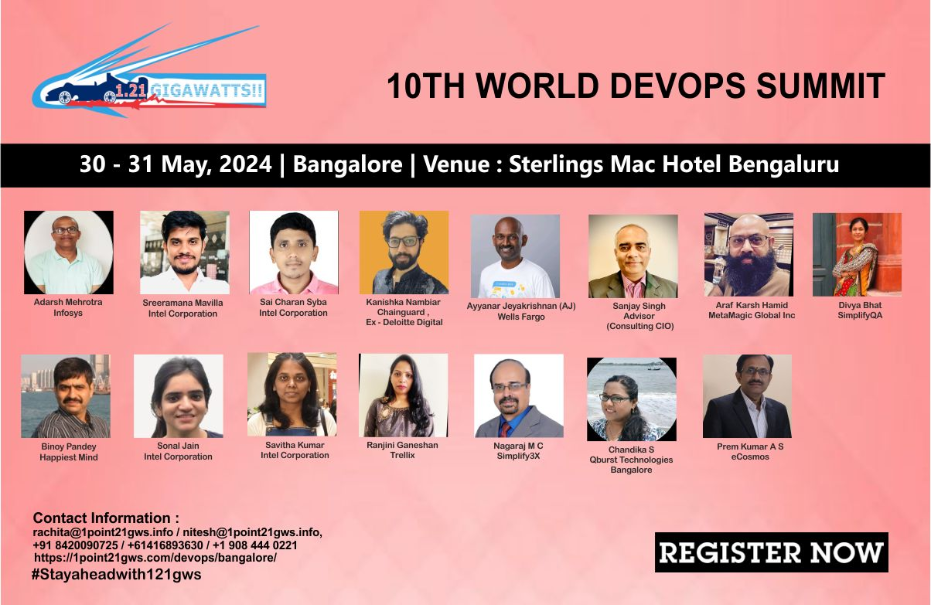
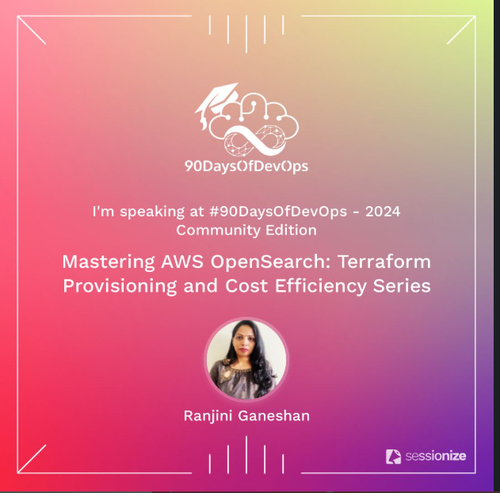
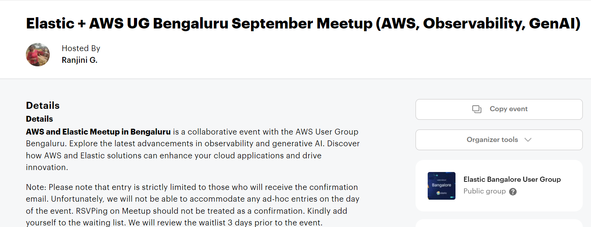

👩 Hi, I'm Ranjini Ganeshan, a Senior DevOps Engineer with over 15 years of experience in building, automating, and scaling enterprise-grade infrastructure. I am passionate about sharing my knowledge and experiences through meetups and technical discussions, empowering others in the tech community.

👩🏻‍🎓 I hold a degree in Computer Science from Vishveshwariah Technical University, Bengaluru.

💭 Currently, I am exploring the fascinating world of Machine Learning, combining my DevOps expertise with cutting-edge AI technologies.

I have shared my expertise in observability through hands-on tutorials and real-time use cases on the DataOps Channel.

📹 **Featured Videos**

   
Learn how to use synthetics canaries for monitoring and proactive issue detection. This video includes a real-time use case and a hands-on lab.

A deep dive into synthetics canaries, exploring advanced concepts and implementations with real-time scenarios and practical demonstrations.
Amazon Q: Real-Time Use Case and Hands-On Lab

Explore Amazon Q with a real-world scenario and step-by-step guidance in this detailed hands-on session.

🎤 **Meetups**

I actively contribute to the tech community by sharing insights and practical knowledge in meetups.

I Presented in  AWS community Meetup  Novemember 2025 Bengaluru agentless observability using a scraper with AWS Managed Grafana and AWS Managed Prometheus.
Showcased insights from DevOps Guru’s ML-powered alerts. 

I presented in Elasticsearch in October 2025: Anomaly Detection with Elasticsearch for AWS Instances. I demonstrated Anomaly Detection with Elasticsearch to monitor AWS instances.

I presented at the World DevOps Summit in July 2024. Demonstrated log Anomaly using AWS OpenSearch on AWS EKS.

I presented about AWS Managed OpenSearch in the 90 Days of DevOps community.

✍️ **Blog Posts in Medium**

I share my experiences, insights, and technical learnings through various blog posts. Below are some of the latest ones

[Grafana in the Cloud: AWS Managed Grafana](https://medium.com/@ranjiniganeshan/grafana-in-the-cloud-aws-managed-grafana-9c530539a448)

[Amazon Cloudwatch to Detect Anomalies](https://medium.com/@ranjiniganeshan/amazon-cloudwatch-to-detect-anomalies-060f1ecfdb84)

[Building a Docker image using AWS EC2 Image Builder](https://medium.com/@ranjiniganeshan/building-a-docker-image-using-aws-ec2-image-builder-704e5211e736)

[How to Save Money on AWS: 10 Simple Steps](https://medium.com/@ranjiniganeshan/how-to-save-money-on-aws-10-simple-steps-85adb740bbf5)

[Mastering AWS OpenSearch: Terraform Provisioning and Cost Efficiency Series](https://medium.com/@ranjiniganeshan/aws-opensearch-series-69b383dc7a46)

[AWS Trusted Advisor and AWS Pricing Calculator](https://medium.com/@ranjiniganeshan/aws-trusted-advisor-and-aws-pricing-calculator-46828424b2a8)

[Finops blog Series 6. Monitor your organization AWS resource usage to optimize cost.](https://medium.com/cloudnloud/finops-blog-series-6-monitor-your-organization-aws-resource-usage-to-optimize-cost-c045ed28c99f)

[Finops blog Series 5. Eliminate NAT gateway traffic charges to Amazon Simple Storage Service](https://medium.com/@ranjiniganeshan/finops-blog-series-5-eliminate-nat-gateway-charges-traffic-to-amazon-simple-storage-service-e49654586c02)

[Finops blog Series 4. Eliminate Bastion host for connecting to private ec2.](https://medium.com/cloudnloud/finops-blog-series-4-eliminate-bastion-host-for-connecting-to-private-ec2-cb24eab079cb)

[Finops blog Series 3. Use Cloudfront to host Static and Dynamic content/ Integrate Cloudfront with Application Loadbalancer.](https://medium.com/cloudnloud/finops-blog-series-3-6cd6fec07fef)

[Finops blog Series 1. Autoscale Using Custom Cloudwatch Metrics to Reduce AWS Cost.](https://medium.com/cloudnloud/finops-blog-series-1-autoscale-using-custom-cloudwatch-metrics-to-reduce-aws-cost-472d880f315b)

[Amazon CloudWatch Synthetics](https://medium.com/@ranjiniganeshan/amazon-cloudwatch-synthetics-17e1a0b7bc1f)

## 🏠 Hosted Meetup: Elastic and AWS Meetup in Bengaluru ✨

We hosted an exciting **Elastic and AWS Meetup** in collaboration with the AWS community! The event was held in **Bengaluru** and was a great success.  
This meetup was a great opportunity to learn about **Elastic** innovations, best practices, and **AWS integration**.

